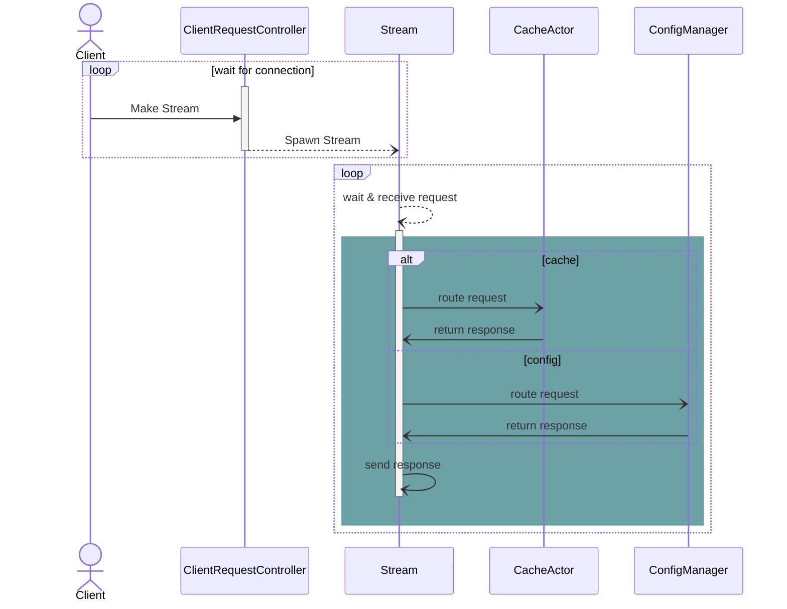
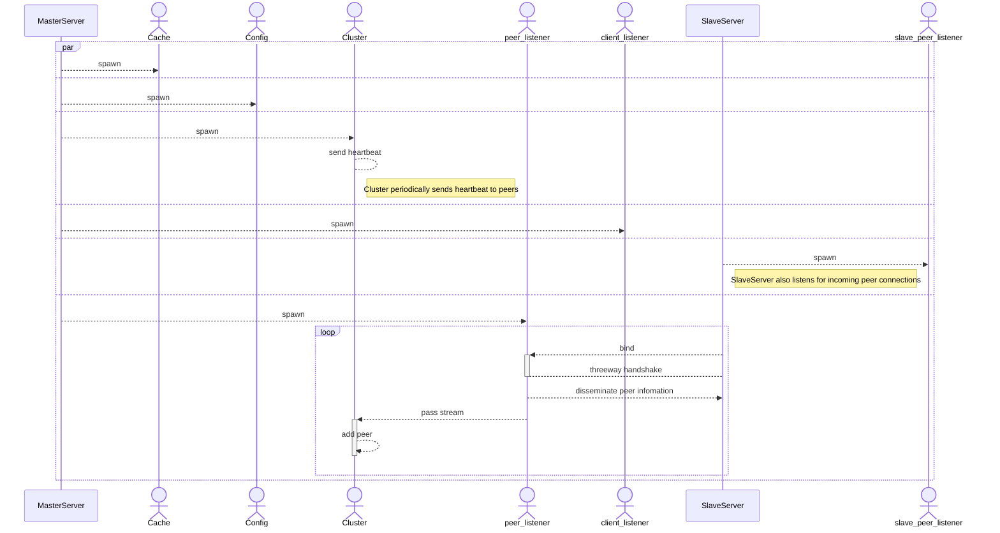

## Duva
Duva is a distributed cache server aimed at efficient and scalable key-value store operations using Actor models, written in Rust


### Why the Actor model?
Designed to handle concurrent, distributed, and scalable systems, it models independent units of computation (actors) that communicate solely via message passing. 
It offers several advantages, and the following is a non-exhaustive list of pros
- High concurrency: Systems requiring thousands or millions of lightweight concurrent entities.
- Event-driven architecture: Applications that rely on asynchronous event processing.
- Distributed systems: Systems spanning multiple servers or nodes.
- Fault tolerance: Systems where reliability and recovery from failure are critical.


### Features
The following features have been implemented so far:

- Core Commands
    - SET: Store a key-value pair.
        - Expiration: Set a time-to-live (TTL) for keys.
    - GET: Retrieve the value associated with a key.
    - KEYS (with pattern matching): Retrieve keys matching specific patterns.
    - SAVE: dump data to the designated file path

- Advanced Features
    - Auto Deletion: Automatically remove expired keys.
    - Local Sharding: Efficiently manage data distribution across local actors.
    - Configuration Settings: Customize server behavior with adjustable configurations.
    - Persistence:
        - Dump data into an rdb file (similar to Redis’ dump.rdb).
        - Append Only File
        - 


- Protocol Support
    - RESP Protocol: Fully implemented for parsing client requests, ensuring compatibility with Redis-like commands.


### Diagrams
#### Client request control


#### Clustering


### Getting Started
#### Prerequisites
- Rust (latest stable version)


Build the project:

```sh
cargo run
```

If you have dump file, and you can load them up on start-up,
```sh
cargo run -- --dir directory-path --dbfilename filename
```


### Protocol
This server supports the RESP Protocol, enabling interaction with clients in a familiar Redis-like manner.

### Roadmap
Future enhancements may include:

- Distributed sharding
- Replication
    - Anti-entropy mechanism (dotted version vector)
    - Dissemination (TBD)
- Pub/Sub support
- More advanced data types (e.g., lists, sets, hashes)
- Write-through / read-through support

### Contributing
Contributions are welcome! Please fork the repository and submit a pull request for review.

### License
This project is licensed under the MIT License. See the LICENSE file for details.

