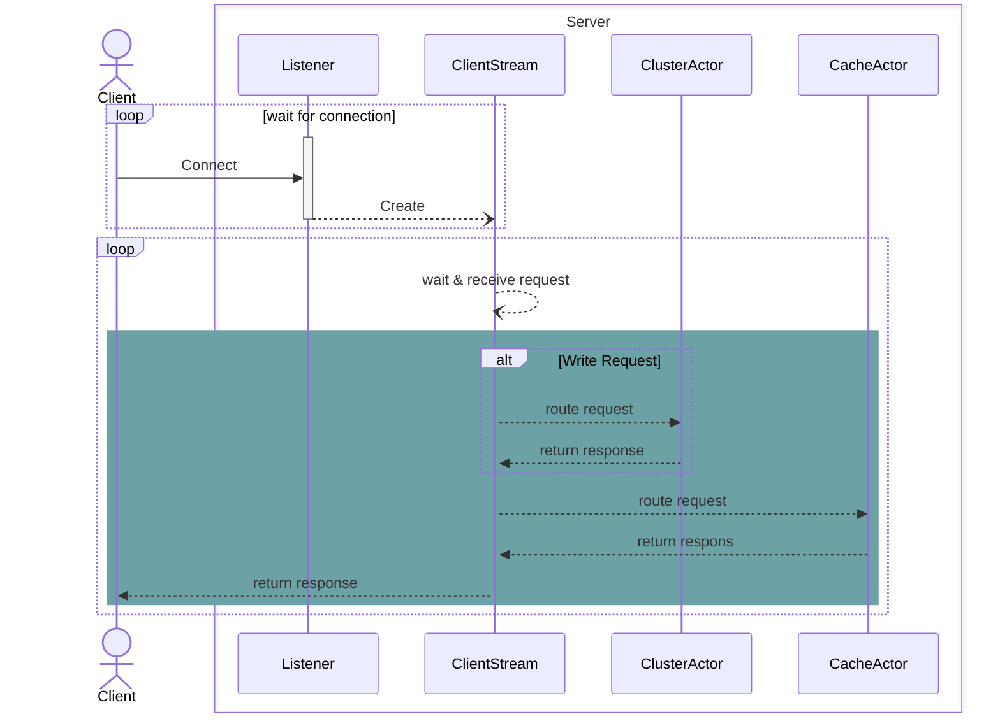
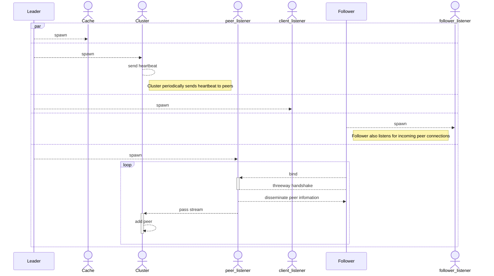
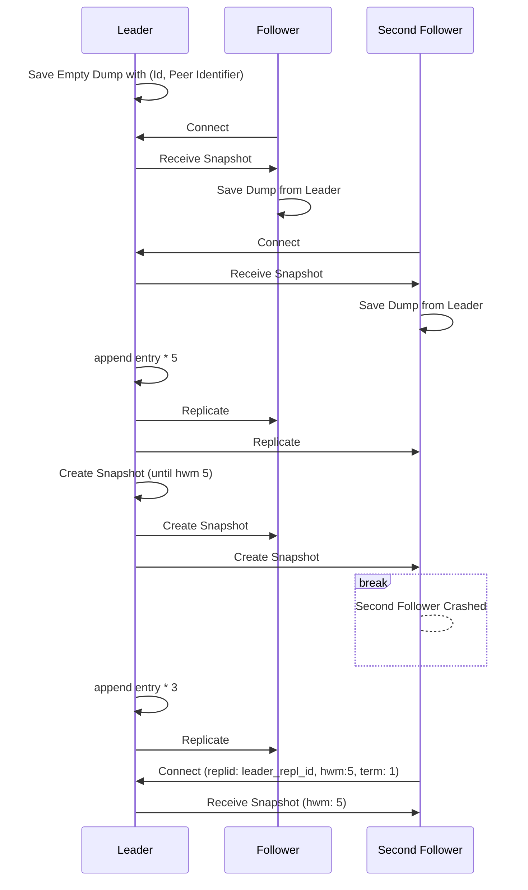
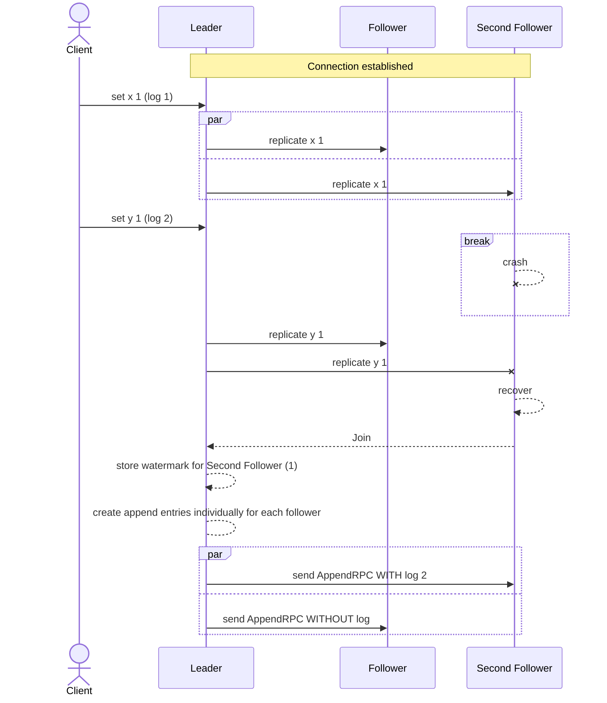
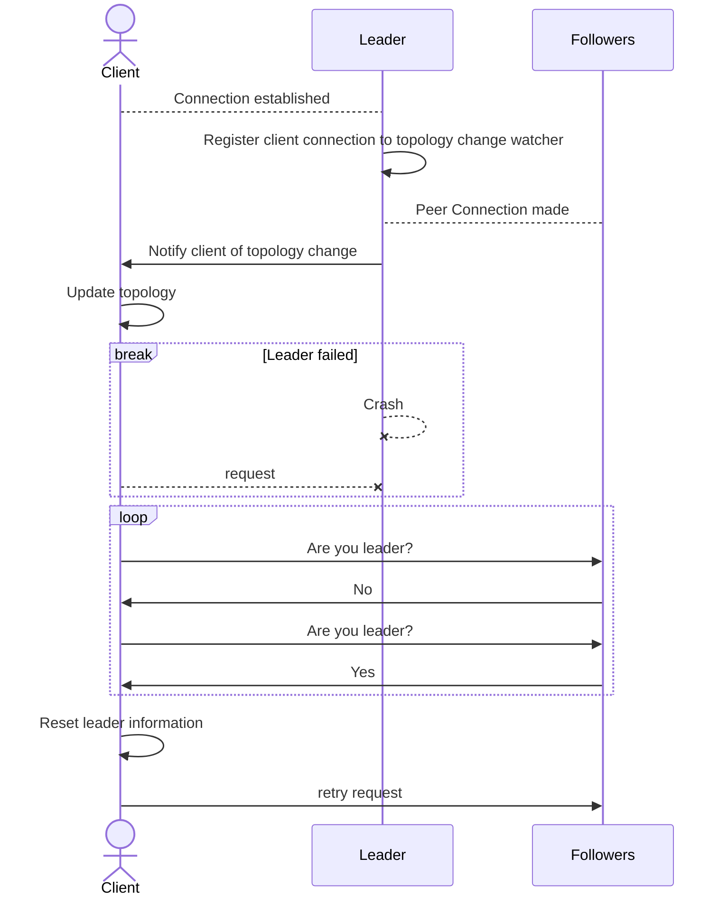
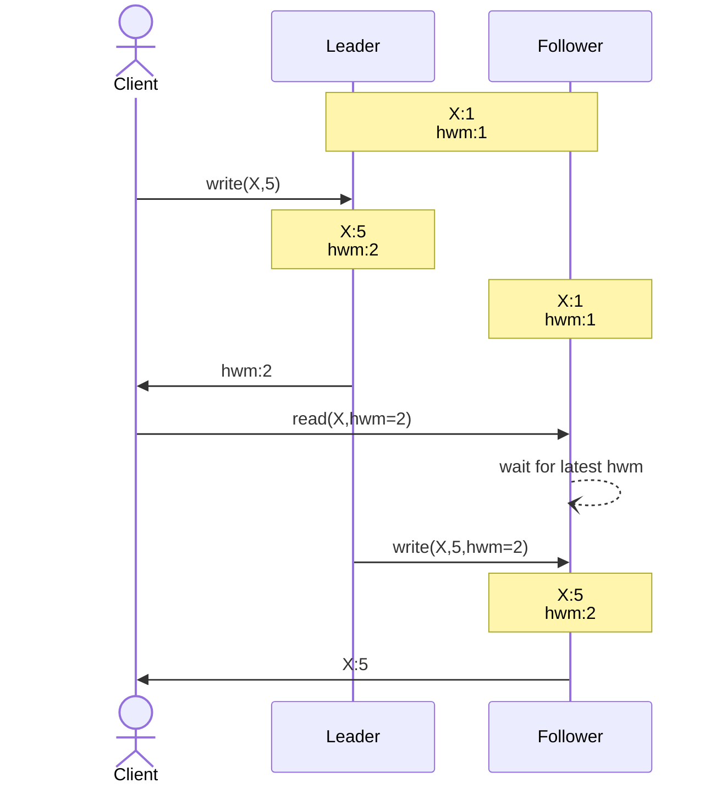

## 📚[Documentation](https://migorithm.github.io/duva/) 
**Duva** is a distributed cache server designed for high performance and scalability. 
It uses the Actor model to manage concurrency, clustering, and consistency, and is built in Rust.

https://github.com/user-attachments/assets/d14a85a7-5edb-4466-8bd0-f538b3d7d27d


## Why the Actor model?
The Actor model is well-suited for concurrent, distributed, and event-driven systems. 
It enables high scalability by modeling independent units of computation (actors) that communicate via message passing.<br>

Key benefits:
- High concurrency: Supports millions of lightweight concurrent entities.
- Event-driven: Naturally fits asynchronous message handling.
- Distributed-friendly: Ideal for systems spanning nodes or data centers.
- Fault-tolerant: Isolates failures and recovers gracefully.


## 💡 Features
The following features have been implemented so far:

- Core Commands inspired by Redis
    - `SET` with optional TTL
    - `GET`
    - `MGET`
    - `KEYS` (supports glob patterns)
    - `SAVE`
    - `EXISTS`
    - `DEL`
    - `INCR`
    - `DECR`
    - `CLUSTER MEET`
    - `CLUSTER FORGET`
    - ...and more
    

- Advanced Features
    - Auto Deletion: Automatically remove expired keys.
    - Local Sharding: Efficiently manage data distribution across local actors.
    - Configurable server behavior
    - Persistence:
        - RDB-like dump (SAVE)
        - Append Only File (AOF) logging
        - 
        - Replicated log (in-memory & disk-backed)
    - 🔄 Replica Sync (full + partial)
    - Failure detection via Gossip
    - Follower reads with RYOW consistency 
    - Push-based topology change notification
    - Eviction Policy - LRU(default)
    - Partitioning 
    - Rebalancing - Eager


- Protocol Support
    - RESP Protocol: fully supported for wire compatibility


## 📑 ReplicatedLogs
Duva includes two pluggable replicated log implementations:

### In-Memory Log
- Lightweight and fast
- Ideal for testing or ephemeral environments
- Volatile (data lost on restart)
- Minimal latency and resource overhead

### Disk-Based Segmented Log
- Durable and production-ready
- Implements segmented log pattern
- Active segments for writes, rotated for archival/compaction
- Backed by in-memory index
- Optimizes read performance
- Increases OS page cache hit rate
- Supports high-throughput workloads with persistence
- Both implementations conform to a unified interface, allowing seamless swapping depending on the environment.


## Diagrams
### Client request control



### Clustering


### Synchronization on connection
There are quite a few scenarios related to this. For this, take a look at the diagram.
The following is the partial sync scenario on startup:




### Partial synchronization for reconcilation


### Push-based topology change notification


### RYOW consistency guarantee (follower reads)
This ensures that clients always see their most recent writes, even when reading from followers—providing a smooth, consistent user experience without unnecessary load on the leader.

This ensures that clients never read stale data after a successful write, improving both performance and consistency without requiring all reads to go to the leader. With this enhancement, Project X delivers stronger guarantees, lower latency, and improved scalability🚀.



## Strong consistency with Raft

### Election (normal flow)
- Follower becomes candidate after randomized election timeout
- Increments term, votes for self, sends RequestVote
- Majority wins become leader
- Leader sends periodic AppendEntries (heartbeat)

### Split-Brain Handling
- Split votes → no winner
- Retry election after next timeout window


## Failure Detection
The system doesn't cooridnate important decisions that rely on eventual consistency like gossip dissemination. 
However, general information, such as node liveness can be efficiently propagated using such an algorithm.
Duva achieves failure detection using `Gossip mechanism` which may evolve into a hybrid gossip algorithm based on `Plumtree`.
Heartbeat frequency and timeout period before considering a node as failed are highly configurable:
```sh
cargo run -- --hf 100 --ttl 1500
```
Here `hf` means heartbeat is sent every 100ms.
If a peer known to the given node has not sent a heartbeat within 1500ms (ttl), it is considered dead and removed from the list.


## 🚀  Getting Started
### Prerequisites
- Rust (latest stable version)


### Build & Run

```sh
# Standalone
make leader
```

```sh
# cluster

make leader p=6000 tp=repl0 
make follower rp=6001 p=6000 tp=repl1 
make follower rp=6002 p=6000 tp=repl2
```


## Protocol
This server supports the RESP Protocol, enabling interaction with clients in a familiar Redis-like manner.

## 🛣 Roadmap
Future enhancements will include:

- Distributed sharding
- Pub/Sub support
- More advanced data types (e.g., lists, sets, hashes)
- Write-through / read-through support

### Contributing
Contributions are welcome! Please fork the repository and submit a pull request for review.

Currently branch rule is enforcing that your branch matches a pattern that one of below:
- "master"
- "hotfix/*"
- "fix/*"
- "feat/*"
- "chore/*"

### License
This project is licensed under the Apache License 2.0. See the [LICENSE](./LICENSE) file for details.
