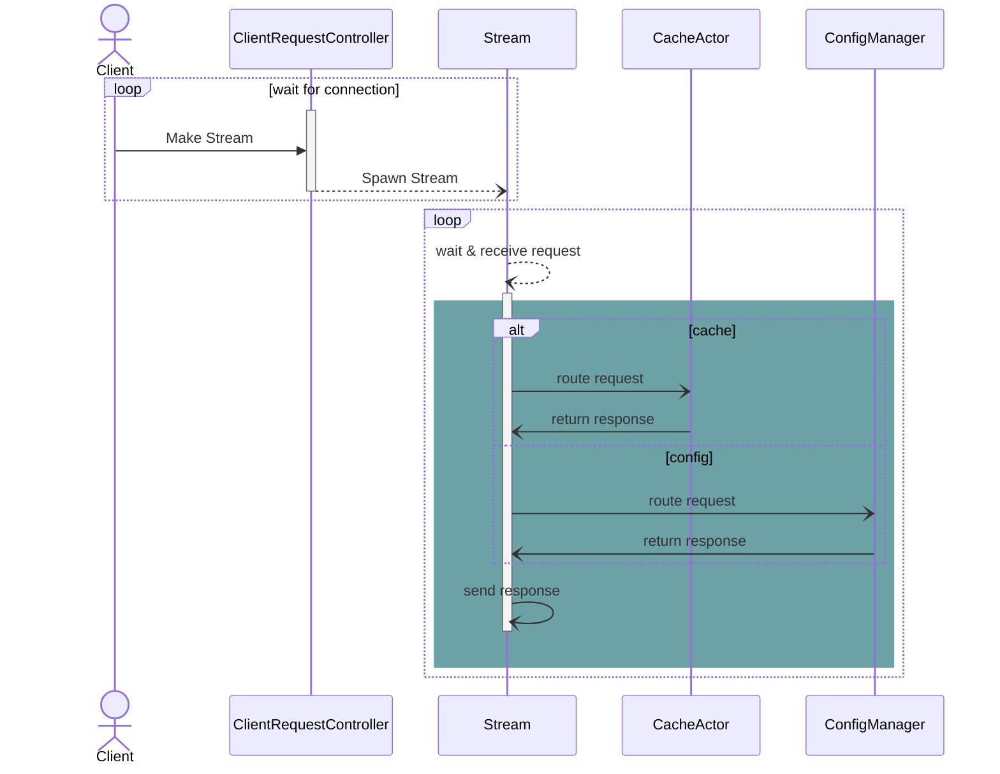
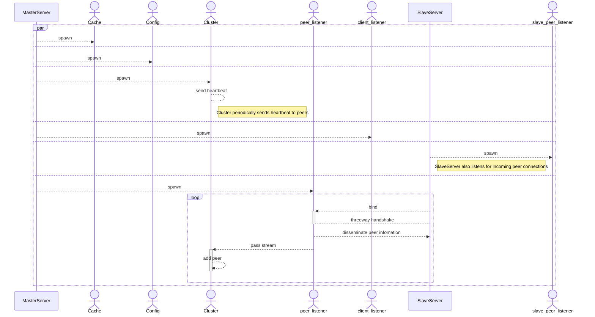

## Duva
Duva is a distributed cache server aimed at efficient and scalable key-value store operations using Actor models, written in Rust


### Why the Actor model?
Designed to handle concurrent, distributed, and scalable systems, it models independent units of computation (actors) that communicate solely via message passing. 
It offers several advantages, and the following is a non-exhaustive list of pros
- High concurrency: Systems requiring thousands or millions of lightweight concurrent entities.
- Event-driven architecture: Applications that rely on asynchronous event processing.
- Distributed systems: Systems spanning multiple servers or nodes.
- Fault tolerance: Systems where reliability and recovery from failure are critical.

### Conventions Used in This Project
`-er` or `-Actor` postfix are used in this project to denote it works as either transient or long-running actor


### Features
The following features have been implemented so far:

- Core Commands
    - SET: Store a key-value pair.
        - Expiration: Set a time-to-live (TTL) for keys.
    - GET: Retrieve the value associated with a key.
    - KEYS (with pattern matching): Retrieve keys matching specific patterns.
    - SAVE: dump data to the designated file path
    

- Advanced Features
    - Auto Deletion: Automatically remove expired keys.
    - Local Sharding: Efficiently manage data distribution across local actors.
    - Configuration Settings: Customize server behavior with adjustable configurations.
    - Persistence:
        - Dump data into an rdb file (similar to Redis’ dump.rdb).
        - Append Only File
        - 
    - Full File Synchronization to Replica
    - Failure detection
    - Cluster node liveness check
    - Cluster commands:
        - Forget 


- Protocol Support
    - RESP Protocol: Fully implemented for parsing client requests, ensuring compatibility with Redis-like commands.


### Diagrams
#### Client request control


#### Clustering


### Strong consistency with Raft(RFC)

#### Election (normal flow)
There are two timeout settings which control elections.
- `Election timeout` : amount of time a follower waits until becoming a candidate, randomized to be between 150-300ms
  - After elecction timeout, the follower becomes a candidate and start a new election term. In this case system:
    - increases value `term` by 1
    - starts counting voting(which is from 1 as it votes for itself)
    - sends `Request Vote` messages to other nodes
  - If the receiving node hasn't voted YET in this term, it votes for the candidate and resets its election timeout(and increase its `term` by 1 and mark it's voting state for candidate -> `Vote for` state).
  - Once a candiate gets a majority of votes, it becomes a leader. 
  
- The leader begins sending out `Append Entries` messages to its followers, the interval of which is specified by the `heartbeat timeout`
  - Followers get `Append Entries` and then change state from `Vote for: {node identifier}` ->  `Leader : {leader_node identifier}`
  - The election term continues until a follower stops receiving heartbeats and becomes a candidate


#### Election in split brain
- If two candidates occur at the same time, it causes race. Let's say we have two candidates(A,B) and two potential followers(C,D).
- `Request Vote` arrives at two node(C,D) 
  - C votes for A
  - D votes for B
- Now, each candidate has 2 votes and can receive no more for this term.
- Then EVERY NODES wait one more round of `election timeout` and send `Request vote` again.


### Failure Detection
The system doesn't cooridnate important decisions using the protocol using eventually consistent like gossip dissemination. 
However, general information, such as node liveness can be efficiently propagated using such an algorithm.
Duva achieves failure detection using `Gossip mechanism` which may evolve into a hybrid gossip algorithm based on `Plumtree`.
Heartbeat frequency and timeout period before considering a node as failed are highly configurable:
```sh
cargo run -- --hf 100 --ttl 1500
```
Here `hf` means heartbeat is sent every 100ms.
If a peer known to the given node has not sent a heartbeat within 1500ms (ttl), it is considered dead and removed from the list.


### Getting Started
#### Prerequisites
- Rust (latest stable version)


Build the project:

```sh
cargo run
```

If you have dump file, and you can load them up on start-up,
```sh
cargo run -- --dir directory-path --dbfilename filename
```


### Protocol
This server supports the RESP Protocol, enabling interaction with clients in a familiar Redis-like manner.

### Roadmap
Future enhancements will include:

- Distributed sharding
- Replication
    - TransactionLog
- Pub/Sub support
- More advanced data types (e.g., lists, sets, hashes)
- Write-through / read-through support

### Contributing
Contributions are welcome! Please fork the repository and submit a pull request for review.

### License
This project is licensed under the MIT License. See the LICENSE file for details.

